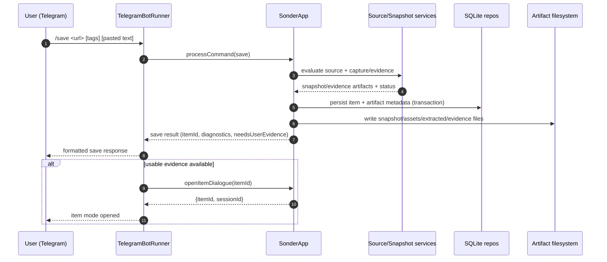
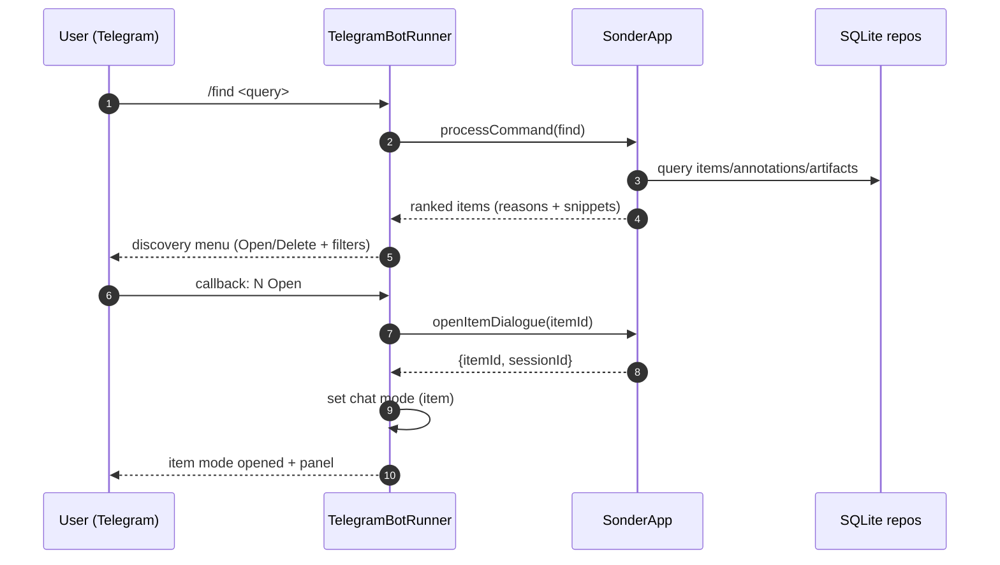
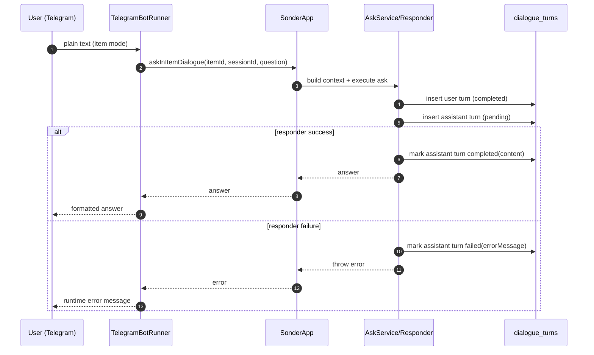
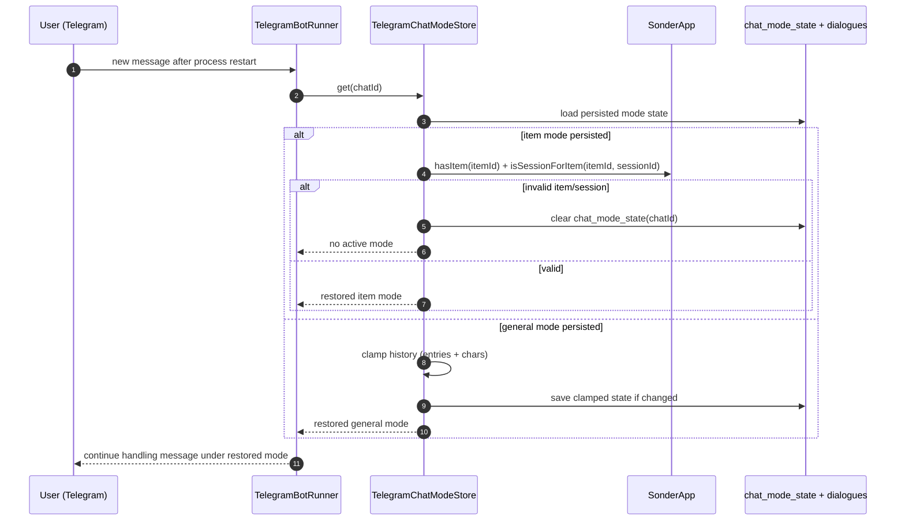

# Sonder data flow

This document explains how data moves through Sonder in the current MVP implementation.

Use this together with:
- `packages/sonder/README.md` (operator usage)
- `packages/sonder/project.md` (maintainer overview)
- `docs/sonder-implementation-checklist.md` (invariants/audit)

## 1) System boundaries

Sonder has three main runtime surfaces:

1. **Telegram transport** (`src/transport/*`)
   - receives updates (messages/callbacks)
   - converts user actions into app calls
   - renders responses/menus

2. **Application/runtime layer** (`src/app/*`, `src/runtime/*`)
   - command orchestration
   - save/find/list/open/history/session logic
   - dialogue context building and responder invocation

3. **Storage + artifacts** (`src/storage/*`, `src/snapshot/*`, rootDir files)
   - SQLite records for items/artifacts/annotations/dialogues/chat mode
   - filesystem artifacts (`snapshot.html`, assets, extracted text, evidence)

Viewer is a separate local HTTP surface (`src/viewer/*`) that reads snapshot data and writes annotation records.

## 2) High-level data map

```text
Telegram User
   |
   v
Telegram API <-> TelegramBotRunner (transport)
   |                    |
   |                    +-> chat mode cache/restore (TelegramChatModeStore)
   v
SonderApp (application facade)
   |
   +-> command parsing + orchestration
   +-> AskService (item dialogue)
   +-> retrieval/list/find
   +-> annotation/item/session helpers
   |
   +-> Repos (SQLite)
   |      - items
   |      - artifacts
   |      - annotations
   |      - dialogue_sessions / dialogue_turns
   |      - chat_mode_state
   |
   +-> Snapshot/Source adapters + filesystem artifacts

Viewer Server (local HTTP)
   +-> reads snapshot/artifacts
   +-> reads/writes annotations via app
```

### 2.1 Sequence diagrams (Mermaid)

#### Save flow (`/save`)



#### Discovery to item-open flow (`/find` + callback)



#### Item ask turn lifecycle (`pending -> completed|failed`)



#### Restart restore flow (chat mode)



## 3) Startup flow

### Telegram mode (`src/cli/run-telegram.ts`)

1. Build `SonderApp` with configured root dir + responder.
2. Build Telegram API client.
3. Build `TelegramBotRunner` with app + API.
4. Poll loop:
   - `getUpdates(offset)`
   - dispatch each update to message/callback handlers
   - send responses via `sendMessage`

### One-shot CLI mode (`src/cli/run-once.ts`)

1. Build app.
2. Parse one command from argv.
3. Execute app command once.
4. Print formatted response and exit.

## 4) Save flow (`/save` or URL+pasted text)

Main entry: `SonderApp.processCommand(...)` or Telegram URL-text extraction path.

1. **Input normalization**
   - parse URL, tags, optional pasted evidence.

2. **Source evaluation** (`src/sources/*`)
   - classify platform/status (`ok`, `blocked`, `login_required`, etc.)
   - choose direct snapshot path vs evidence-required path.

3. **Capture/evidence generation** (`src/snapshot/*`)
   - direct capture: snapshot HTML + assets + extracted text
   - fallback/evidence mode: store pasted text as durable evidence artifacts

4. **Persistence (transactional in app)**
   - create/update item record
   - create artifact records
   - ensure partial writes are cleaned on failure

5. **Return command result**
   - includes source diagnostics and whether user evidence is still needed
   - Telegram transport may auto-open item mode when save produced usable evidence

## 5) Discovery flow (`/list`, `/find`)

Main entry: Telegram command -> `app.processCommand(...)`.

1. App resolves list/find query.
2. App collects candidate items and retrieval features.
3. For `/find`, app produces weighted matches with:
   - reasons
   - snippets
4. Transport converts results into indexed menu entries (no raw IDs shown).
5. Transport sends inline keyboard (Open/Delete + filter controls).
6. Callback actions mutate menu state in memory (time/source/tag/sort/page) and re-render.

## 6) Item dialogue flow (`/open <itemId>` + plain text)

### Open/resume

1. User opens item via command or callback.
2. App resolves session:
   - resume latest existing session by default
   - or create new session
3. Transport stores chat mode (`item`, `itemId`, `sessionId`) via `TelegramChatModeStore`.
4. State is persisted in `chat_mode_state` for restart recovery.

### Ask turn

1. Plain text arrives while mode is `item`.
2. Transport calls `app.askInItemDialogue(itemId, sessionId, question)`.
3. Ask runtime builds context (`annotations -> dialogue history -> extracted text`).
4. Turn lifecycle persistence:
   - user turn stored as `completed`
   - assistant turn inserted as `pending`
5. Responder executes.
6. On success: assistant turn -> `completed` with content.
7. On failure: assistant turn -> `failed` with error message.
8. Transport sends formatted answer or runtime error text.

## 7) General dialogue flow (`/open` without itemId)

1. `/open` creates general session id.
2. Transport stores mode `{ mode: "general", sessionId, history }`.
3. Plain text in general mode calls `app.chatWithoutItem(...)`.
4. Transport appends user/assistant entries to general history.
5. History is persisted in `chat_mode_state`.
6. History is bounded by:
   - `MAX_GENERAL_HISTORY_ENTRIES`
   - `MAX_GENERAL_HISTORY_CHARACTERS`

These bounds are specific to Telegram general mode; item dialogue persistence uses `dialogue_turns`.

## 8) History/session flows

### `/sessions`

1. App lists item sessions.
2. Transport renders `Resume` and `New Session` buttons.
3. Callback calls app to resume/create and then updates chat mode.

### `/history`

- Item mode: app returns persisted dialogue turns for the session.
- General mode: transport reads in-memory/persisted general-mode history.
- Telegram history menu supports pagination + per-turn full view.
- Page transitions are clamped to valid bounds.

## 9) Viewer data flow

Main server: `src/viewer/server.ts`.

1. Browser requests item viewer page.
2. Server serves sanitized snapshot rendering + sidebar UI.
3. Annotation API operations (create/list/update/delete) call app methods.
4. App writes annotation records in SQLite.
5. On next dialogue turn, annotation content participates in context build.

Error contracts:
- validation/domain errors map to `400 BAD_REQUEST` / `404 NOT_FOUND`
- unexpected failures map to `500 INTERNAL_ERROR`

## 10) Chat mode restore flow (restart-safe)

1. On new incoming Telegram update, runner asks `TelegramChatModeStore.get(chatId)`.
2. Store checks in-memory mode first.
3. If absent, load persisted `chat_mode_state` from DB.
4. For item mode, validate item/session still exist.
   - if invalid: auto-clear persisted state
5. For general mode, restore and clamp history bounds.
6. Continue processing the new message under restored mode.

## 11) Deletion flow

1. User triggers delete from discovery menu or item context panel.
2. Transport calls `app.deleteItem(itemId)`.
3. App deletes item graph (annotations, dialogues, artifacts metadata) + artifact files.
4. Transport clears active item mode if it referenced the deleted item.
5. Menus are updated to remove deleted entry.

## 12) Persistent data model (conceptual)

- `items`: canonical saved units
- `artifacts`: snapshot/evidence/extracted-text metadata
- `annotations`: highlight/underline/note records
- `dialogue_sessions`: per-item conversation sessions
- `dialogue_turns`: per-turn records with lifecycle status
- `chat_mode_state`: per-chat active mode/session + general history

Filesystem under `rootDir` stores artifact payloads referenced by `artifacts.path`.

## 13) Current invariants to keep in mind

- Transport should not reach into DB internals directly; use app APIs.
- Command parsing is centralized in `src/commands`.
- Command matching is exact token based.
- Failed assistant turns are persisted and visible in history.
- Save path keeps DB/file consistency (transaction + cleanup on failure).
- Telegram callback menus are TTL-based, ephemeral interaction state.

## 14) Extension points

Most common future changes and where to hook them:

- Retrieval/index scaling: app retrieval path + storage migrations
- Retry/backpressure/telemetry: transport runner + app service boundaries
- New source adapters: `src/sources/*` + save pipeline integration
- New responder/provider behavior: `src/runtime/responders/*`
- Viewer capabilities: `src/viewer/*` + annotation schema/API
